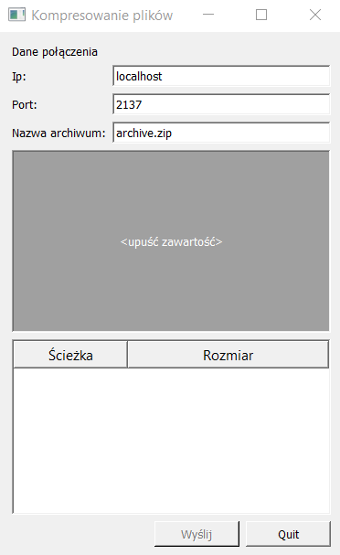

# Computer Networks 2 Project - Remote File Compression Server&Client

Authors: Jan Bylicki, Jan Chlebek



## Compilation

Target system for server: Linux (Arch)
Target system for client: Windows (or any supporting Qt5)

1. Server compilation `gcc -Wall src/server/srv.c -o srv.out`
2. Client compilation in Qt Creator (client package included as a zip file)

## Description of the designed communication protocol:
```
C - client
S - server
# - comment
Each command is terminated with a '\n'.
# ack - acknowledged signal

# 'a' command means an operation on an archive and it always comes first with the name of the archive
C - a name.zip
S - ack
# 'f' command means an operation to add a file to the current path in the archive it has the format f name file_size
C - f name.extension size_in_bytes
S - ack
# after receiving ack for file creation, the client sends as many bytes as declared in the file size
C - <file>
S - ack
# 'd' command means an operation to go to the subfolder, and in case it does not exist, to create it. The structure is 'd folder_name'.
C - d folder
S - ack
C - f name.extension size_in_bytes
S - ack
C - <file>
S - ack
# 'd ..' is a special case of the 'd' command, which goes to the parent folder
C - d ..
S - ack
# 'a end' is an operation on an archive to signal the end of work on it
C - a end
S - ack
# the server sends an 'f' command to the client with information about the archive name and size ...
S - f name.zip size_in_bytes
C - ack
# ... and then the archive itself
S - <file>
C - ack
```


## Description of the server implementation
Server - srv.c - a file containing the whole implementation of the concurrent server, which can be described as follows:
```
1. wait for a connection from the client
2. split the operation:
    parent process - jump back to waiting for another clients.
    child process - jump below
     1. receive the archive initialisation command
     2. reply to the client that you have received the command
     3. receive another command
     4.  until you receive 'a end' command
           1. reply to the client that you have received the command
           2. process the received commands and in the case of command 'f' receive a file of specified size
           3. receive another command
     5. split the operation
       1. parent process
           1. wait for the child process to finish
           2. send the command to send the archive file to the client
           3. wait for the command receipt signal
           4. send file
           5. wait for the file receive signal
           6. end operation
       2. child process: Execute the zip command on all received files
```
## Description of the client implementation
Client - QT5.15.2 MinGW 64-bit
* dropsite.pro - file informing QT Creator or qmake how to compile the project
* dropsarea .h/.cpp - code for handling the drop files field - QT example under BSD license
* dropsitewindow .h/.cpp - code for handling the server and application window 
* main.cpp - window generator


    Course of action:
```
1. generate the window and build the interface, accept individual files/folders dropped to the appropriate field
2. after pressing the 'send' button initiate the connection with the set parameters, then send the command 'a <archive_name>'
3. generate the list of commands to be sent to the server
4. send the generated commands and the files to the server
5. send 'a end'
6. wait for ready archive and download it
7. display the communication log
```
